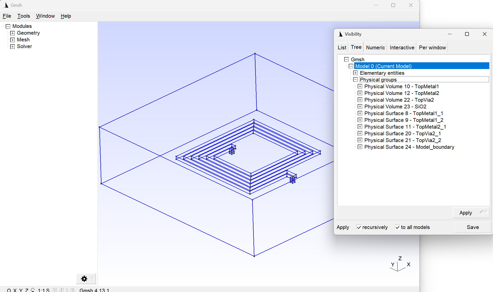
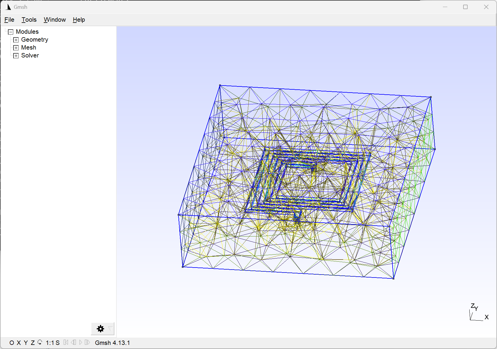

# gds2gmsh

This tool is used in the IHP SG13G2 RFIC design flow, to convert layout
in GDSII file format to a model/mesh for the gmsh meshing tool.
https://gmsh.info/
In addition to creating the gmsh files, material properties are stored 
in *.sif format for use with the ElmerFEM solver.

# Prerequisites

To run the tool, Python libraries gdspy and gmsh must be installed.

# Usage

To build the gmsh model/mesh from the GDSII input file, specify the 
*.gds input filename as the first parameter.

example:
```
python gds2gmsh.py ind_square_100x100.gds
```

This will create 3 output files:
the *.msh file with the mesh from gmsh (no gemetry), 
the *.geo_unrolled file with the geometry for gmsh (no mesh) and
an additional *.sif file with material information for use with ElmerFEM.

The gmsh user interface is started to show the geometry. 



When this window is closed, the user interface comes up again, 
showing the resulting mesh.

Mesh creation is controlled by parameter 'meshseed' that is defined in the code, 
and might need further improvement.



If you get an error message

```
Exception: Curve loop is not closed
```

your GDSII input file needs pre-processing, as described below.

# GDSII files that require pre-processing

One difficulty when bringing GDSII layout data is the data representation of 
holes (cutouts). GDSII uses a concept of self-intersecting (to be more precise: self-touching) 
polygons where the outer boundary of a polygon turns inside and surrounds the hole, 
then returns to the outer boundary. This is frequently used to model holes in metal, 
in normal routing and to fulfill layout density rules. 

This representation is not compatible with gmsh and the OCC kernel: 
duplicate vertices are not allowed, but these will always occur where returning 
from the “inside” boundary (hole) to the exterior boundary.

The resulting error message is:
```
Exception: Curve loop is not closed
```

To overcome this limitation, a GDSII preprocessing step was coded that converts 
the original GDSII file into a “cleaned” version with no self-touching vertices. 
This is achieved by slicing the polygon into multiple small “solid” polygons 
with no more than 6 vertices, to cover the same area.

To run this pre-processing step, run gds_fixholes.py with the gds filename as the 
first commandline parameter. 


example:
```
python gds_fixholes.py mygdsfile.gds
```

This will check for duplicate vertices, remove them and create another GDSII file 
with suffix '_sliced' that you can use with gds2gmsh.

# Theory of operation

The core of layout conversion from GDSII to gmsh is to flatten the layout 
into a flat list of polygons, iterate over all vertices of each polygon and 
build a list of points (1-D) which are then combined to lines of adjacent points (2-D)
which are then combined to a curve loop (2-D) which is then declared as surface (2-D).
For each 2-D surface, the z-position is determined from the source layer by a lookup 
table with stackup information, i.e. z positions of each layer. 
The 2-D surfaces are then extruded in z-direction to give them a finite height, 
as defined in the stackup lookup table, and a 3-D volume object is created from 
the extruded polygons.

For the surrounding dielectric layers (oxide, passivation) and the semiconductor 
substrate below, there is no layout data in the GDSII file, so the xy size of 
these dielectrics are determined from the bounding box of the layer’s layout data, 
plus some margin. Again, the z-position and thickness are obtained from the stackup
lookup table.

Physical 3D groups are defined for each metal layer or dielectric, 
and physical 2D surfaces are defined for each metal or via polygon.

